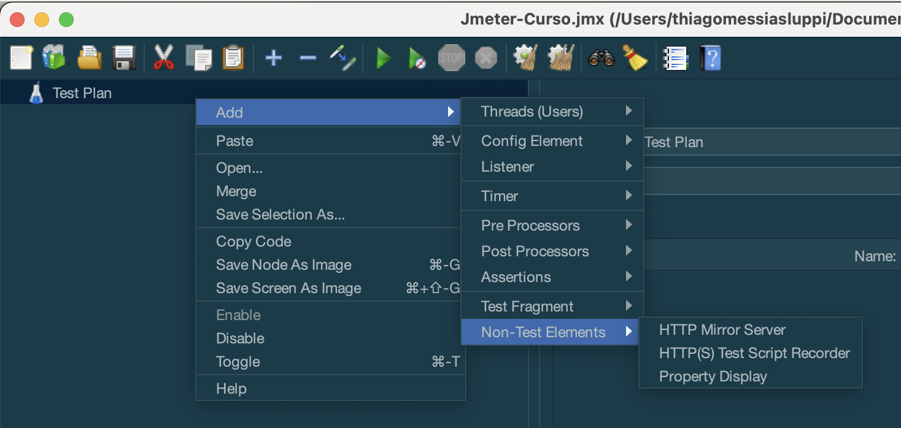
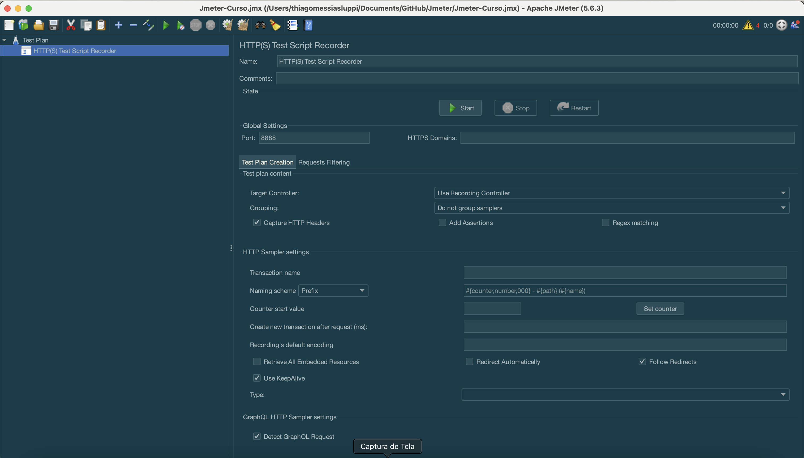
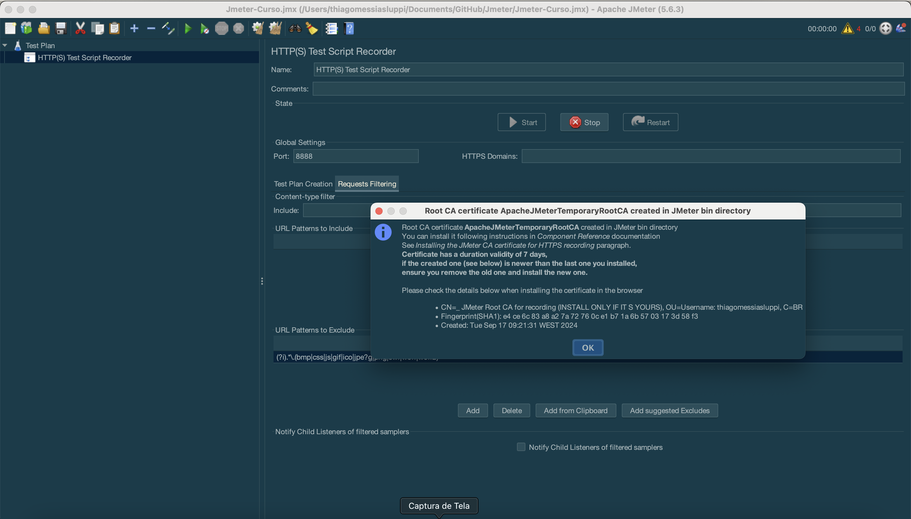
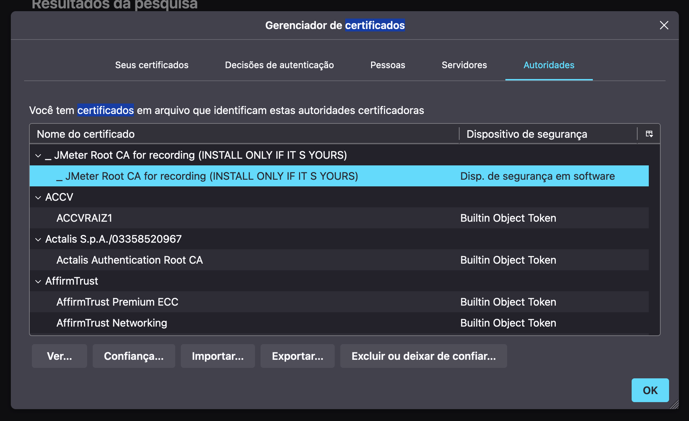

# Learn JMETER from Scratch on Live Apps -Performance Testing


## Como linkar o Firefox para trabalhar com Jmeter

### No Jmeter

Na pagina principal do Jmeter criar um `Non-Test Element` do tipo: `HTTP(S) Test Script Recorder` dentro de `Test Plan`, conforme imagem:


Imagem do elemento criado:


A porta precisa ser `8888` nesse caso. Mude o `Targe Controller` para `Test Plan > HTTP(S) Test Script Recorder` 

Clique na aba `Requests Filtering`

Clique no botão `Add suggested excludes` para que a captura filtre algumas coisas como: `(?i).*\.(bmp|css|js|gif|ico|jpe?g|png|swf|woff|woff2)`.

Agora clique no botão `Start` e uma mensagem vai aparecer:


Essa mensagem diz que um certificado foi criado dentro da pasta `/bin` do Jmeter e precisa passar ele para o Firefox

> **Nota:** Como estou usando o JMeter instalado via Homebrew, o arquivo `ApacheJMeterTemporaryRootCA.crt` pode ser encontrado em:
>
> ```
> /opt/homebrew/Cellar/jmeter/5.6.3/libexec/bin
> ```

### No Firefox

Vá para os `Ajustes` e procure por `certificados`


Em Certificados procure por Autoridades e Importe o arquivo criado pelo Jmeter: `ApacheJMeterTemporaryRootCA.crt`

Se tudo der certo agora deve estar assim:

